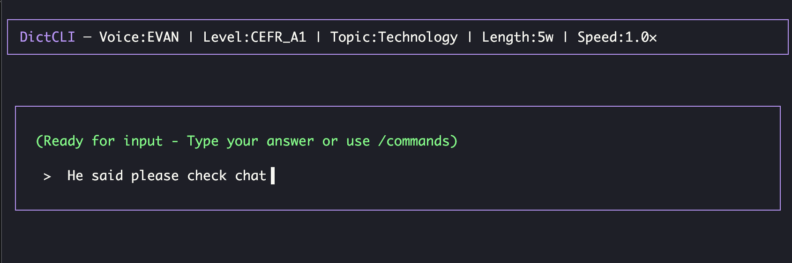
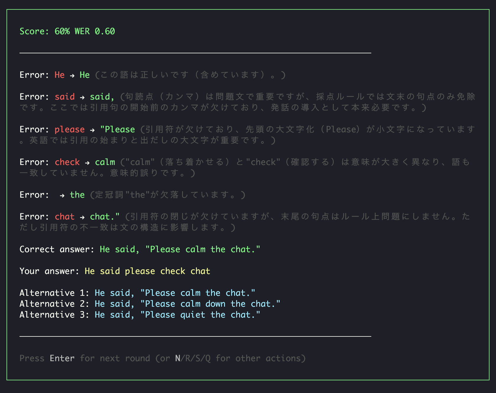

# DictCLI

[](https://badge.fury.io/js/dictcli)
[](https://opensource.org/licenses/MIT)

**DictCLI** is an LLM-powered dictation practice tool for English learners worldwide. It runs in your terminal and uses OpenAI API to generate sentences, play audio, and provide detailed feedback in your native language.

<p align="center">
  
</p>

<p align="center">
  
</p>

## ✨ Features

- 🤖 **LLM-Powered**: Dynamic sentence generation using OpenAI API
- 🎯 **Level-Based Learning**: Choose from 6 CEFR levels (A1-C2)
- 🔊 **Voice Options**: 6 different voices (3 male, 3 female)
- 🌍 **Multilingual Feedback**: Error explanations in 20+ languages (auto-detected)
- ⚡ **Fast Learning Cycle**: Complete rounds in under a minute
- 🎨 **Beautiful TUI**: Polished terminal UI with Ink v4

## 📋 Requirements

- Node.js v20 or higher
- macOS (for audio playback feature)
- OpenAI API key

## 🚀 Installation

### Global Installation (Recommended)

```bash
npm install -g dictcli
```

### Local Installation

```bash
git clone https://github.com/yourusername/dictcli.git
cd dictcli
npm install
npm run build
npm link
```

After installation, you can run it from any terminal:

```bash
dictcli
```

To uninstall:

```bash
npm unlink -g dictcli
```

## 🔧 Setup

### 1. Set OpenAI API Key

Set your OpenAI API key as an environment variable:

```bash
export OPENAI_API_KEY=your-api-key-here
```

To make it permanent, add it to your shell configuration file (`.bashrc`, `.zshrc`, etc.).

### 2. Getting an API Key

1. Visit [OpenAI Platform](https://platform.openai.com/)
2. Create an account or sign in
3. Generate a key on the [API Keys](https://platform.openai.com/api-keys) page
4. Copy the generated key and set it as an environment variable

## 🌍 Language Support

DictCLI automatically detects your system language and provides feedback in your native language. Currently supports:

- 🇯🇵 Japanese
- 🇬🇧 English  
- 🇨🇳 Chinese
- 🇰🇷 Korean
- 🇪🇸 Spanish
- 🇫🇷 French
- 🇩🇪 German
- 🇮🇹 Italian
- 🇵🇹 Portuguese
- 🇷🇺 Russian
- 🇸🇦 Arabic
- 🇮🇳 Hindi
- 🇹🇭 Thai
- 🇻🇳 Vietnamese
- And many more...

The dictation audio remains in English while error explanations adapt to your system language.

## 📖 Usage

### Basic Usage

```bash
dictcli
```

Starts with default settings (Business English, A1 level, 10 words).

### With Options

```bash
dictcli --topic Technology --level CEFR_B1 --words 15 --voice SARA
```

### Available Options

| Option | Description | Choices | Default |
|--------|-------------|---------|---------|
| `--topic` | Learning topic | EverydayLife, Travel, Technology, Health, Entertainment, Business, Random | Business |
| `--level` | Difficulty level | CEFR_A1, CEFR_A2, CEFR_B1, CEFR_B2, CEFR_C1, CEFR_C2 | CEFR_A1 |
| `--words` | Word count | 5-30 | 6 |
| `--voice` | Voice type | ALEX, SARA, EVAN, NOVA, NICK, FAYE | ALEX |

### Voice Descriptions

| Name | Gender | Characteristics |
|------|--------|-----------------|
| ALEX | Male | Friendly, standard voice |
| SARA | Female | Clear and easy to understand |
| EVAN | Male | Calm voice |
| NOVA | Female | Modern voice |
| NICK | Male | Deep voice |
| FAYE | Female | Gentle voice |

## 🎮 Controls

### Learning Screen

- **Type your answer**: Enter the sentence you hear and press Enter
- **Slash commands**: Type `/` to open command menu
  - `/replay` - Replay audio
  - `/settings` - Open settings
  - `/giveup` - Show hint (answer with blanks)
  - `/quit` - Quit application

### Result Screen

- **Enter** or **N** - Next question
- **R** - Replay audio
- **S** - Open settings
- **Q** - Quit application

### Settings Screen

- **↑↓** - Select item
- **←→** - Change value (Voice, Level, Topic)
- **-+** - Increase/decrease (Word Count)
- **Enter** - Save and continue to next question
- **Esc** - Cancel

## 💡 Learning Tips

### Effective Study Methods

1. **Level Selection**: Start with a level where you can answer about 80% correctly
2. **Repetitive Practice**: Practice the same topic repeatedly to master specialized vocabulary
3. **Speed Adjustment**: Adjust playback speed in `/settings` (0.8x-1.2x)
4. **Error Analysis**: Carefully read explanations in your native language to understand error patterns

### Level Guidelines

- **A1**: Basic words and simple sentences
- **A2**: Everyday expressions and basic grammar
- **B1**: Practical expressions for work and travel
- **B2**: More complex grammar and vocabulary
- **C1**: Fluent and natural expressions
- **C2**: Native-level advanced expressions

## 🐛 Troubleshooting

### Common Issues

**Q: Audio doesn't play**
- A: This only works on macOS. Audio features are not available on other OS.

**Q: "OPENAI_API_KEY environment variable is required" error**
- A: Verify that the environment variable is set:
  ```bash
  echo $OPENAI_API_KEY
  ```

**Q: Frequent API errors**
- A: Check if you have remaining OpenAI API credits.

**Q: Characters are garbled**
- A: Make sure your terminal supports UTF-8 and has fonts for your language installed.

### Debug Mode

If problems persist, you can check detailed information in debug mode:

```bash
DICTCLI_DEBUG=true dictcli
```

## 🤝 Contributing

Please report bugs and suggest features via [GitHub Issues](https://github.com/yourusername/dictcli/issues).

Pull requests are welcome!

## 📄 License

MIT License - See [LICENSE](LICENSE) file for details.
